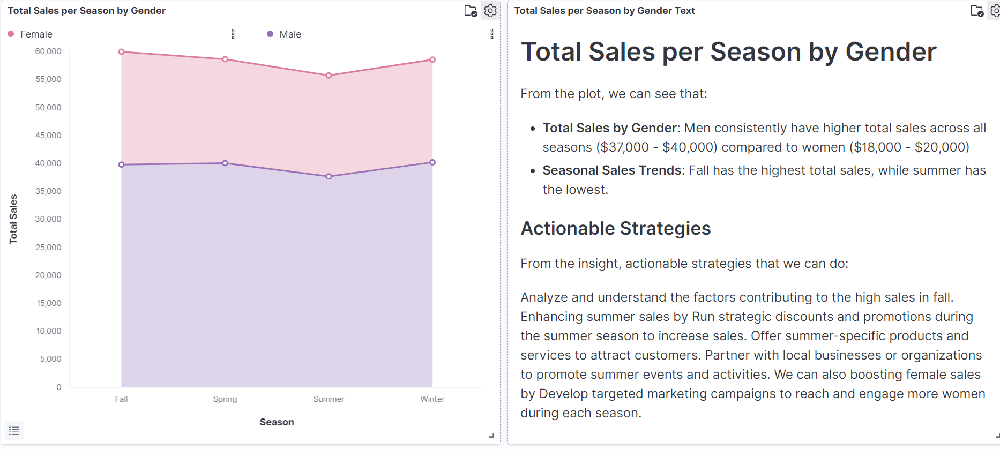
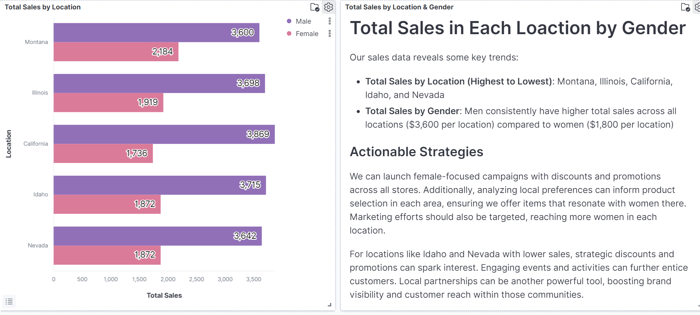
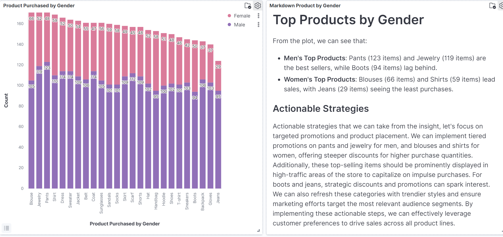
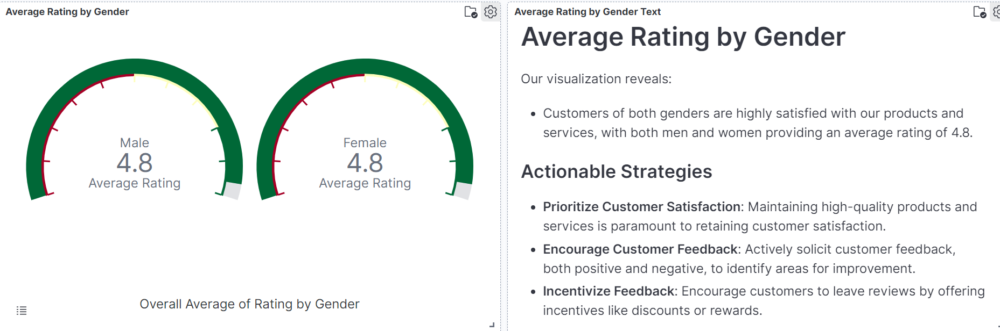
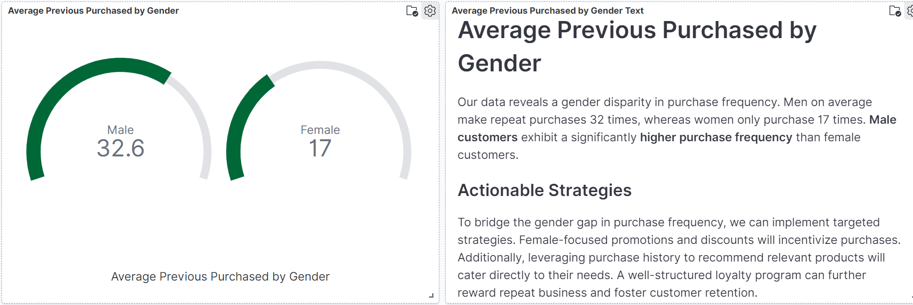
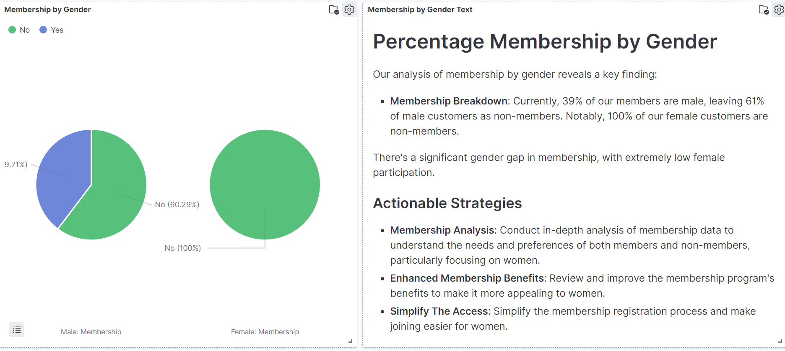
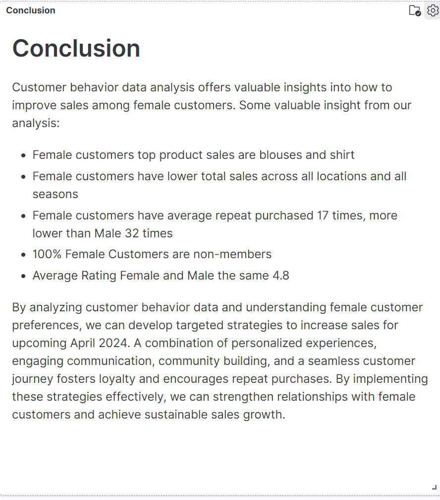

# ETL For E-commerce Transaction Analysis
Developed an automated scheduler for data pre-processing using Apache Airflow for e-commerce transaction xustomers behaviour analysis.

## Project Overview
This ETL projects perform a batch processing with scheduler for automation using Airflow, starting from data extraction from PostgreSQL Database, data cleaning using pandas and data validation using Great Expectation to ensure data quality and consistency. Those process generate a clean data which will then saved to Elasticsearch to be analyzed and visualized using Kibana. This analysis aims to help e-commerce to optimizing female customers sales performance through customers behavior analysis to provide actionable insight and strategic recommendations.

## Tools and Technologies
- Docker
- Airflow
- Elasticsearch
- Kibana
- Python
- Jupyter Notebook
- Pandas

## File Description
- `Airflow_DAG.py` : Airflow DAGs containing the code to extract data from database, perform data cleaning and save data to Elasticsearch.
- `Data_Validation_GX.ipynb` : Jupyter Notebook containing the code for data validation using Great Expectation.
- `ecommerce_data_raw.csv` : CSV file containing the raw data of Ocean Cafe transaction.
- `ecommerce_data_clean.csv` : CSV file containing the clean data of Ocean Cafe transaction.
- `images/` : Folder containing data visualization and analysis result.
- `Customers_Behaviour_Analysis.pdf` : PDF containing data visualization and analysis result for presentation.

## Airflow Process
Airflow process contains three main processes which is data extraction, data cleaning and data saving. This process is scheduled every 6.30 AM everyday. Here are the DAGs result.
(./images/airflow.png)

## Exploratory Data Analysis
---

---

---

---

---

---

## Conclussion
---

## Acknowledgements
E-commerce customers transaction data used in this project was obtained from [Kaggle](https://www.kaggle.com/datasets/zeesolver/consumer-behavior-and-shopping-habits-dataset/discussion?sort=votes)
